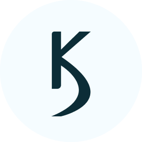

<!-- PROJECT LOGO -->
<br />
<p align="center">
  <a href="https://github.com/KarolusD/portfolio2021/src/assets/images/readme-logo.png">
    
  </a>

  <h3 align="center">Karolus Development</h3>

  <p align="center">
    My personal portfolio & blog website
    <br />
    <br />
    <a href="https://podzerek.pl">View Demo</a>
    <a href="https://github.com/KarolusD/portfolio2021/issues">Report Bug</a>
  </p>
</p>

<!-- TABLE OF CONTENTS -->
<details open="open">
  <summary>Table of Contents</summary>
  <ol>
    <li>
      <a href="#about-the-project">About The Project</a>
      <ul>
        <li><a href="#built-with">Built With</a></li>
      </ul>
    </li>
    <li>
      <a href="#getting-started">Getting Started</a>
      <ul>
        <li><a href="#prerequisites">Prerequisites</a></li>
        <li><a href="#installation">Installation</a></li>
      </ul>
    </li>
    <li><a href="#license">License</a></li>
    <li><a href="#contact">Contact</a></li>
  </ol>
</details>

<!-- ABOUT THE PROJECT -->

## About The Project

[![Karolus Development Screen Shot][product-screenshot]](https://podzerek.pl.com)

This website is devoted for showcasing my skills and recent projects. I am also sharing my adventures with design & code in the blog section. If you are interested in web technologies, user-interface design or programming in general I am inviting you to [read here](https://podzerek.pl/blog).

### Built With

- [Gatsby](https://gatsbyjs.com)
- [styled-components](https://styled-components.com)
- [MDX](https://mdxjs.com)

<!-- GETTING STARTED -->

## Getting Started

To get a local copy up and running follow these simple example steps.

### Prerequisites

- npm

```sh
npm install npm@latest -g
```

### Installation

1. Clone the repo

```sh
git clone https://github.com/KarolusD/Portfolio2021.git
```

2. Install NPM packages

```sh
npm install
```

3. Run npm command

```sh
npm start
```

<!-- LICENSE -->

## License

Distributed under the MIT License. See `LICENSE` for more information.

<!-- CONTACT -->

## Contact

Karol Podżerek - kpodzerek@gmail.com

<!-- MARKDOWN LINKS & IMAGES -->
<!-- https://www.markdownguide.org/basic-syntax/#reference-style-links -->

[product-screenshot]: src/assets/images/site.png
